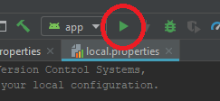

# omni-stack-8 (Tindev)
OmniStack Week (8) by: RocketSeat

## Dependencies to run this project:

###  NodeJs 
Ps: You'll need [NodeJs](https://nodejs.org/en/download/) to run this project.

---

### First, clone project in your PC:

```shell
git clone https://github.com/gabrieldarezzo/omni-stack-8.git
cd omni-stack-8
```

---

## BackEnd (NodeJs)
```shell
cd backend
npm install
```
Wait all dependencies install in `/node_modules`, after finish just run:
```
npm run dev
```


ToDo list (BackEnd):
- [x] Fix bug in /devs, if don't have deslikes || likes will crash list -> Troubleshooting (DevControllers.js)
- [x] Work in LAN network, like: http://192.168.0.16:3333/devs

---

## FrontEnd (ReactJs)

Demo-Screen:  
  

Start 
```shell
cd frontend
npm install
```  
Wait all dependencies install in `/node_modules`, after finish just   
```
npm start
```


## Mobile (React-Native)

Demo-Screen:  
  


### Android in Windows
Before go ahead with this tutorial, I recomend you download [Android Studio](https://developer.android.com/studio), and run a [Hello World](https://medium.com/@rodolfopeixoto/criando-um-projeto-no-android-studio-feacf8a775c4)

Ps: Running on device is easier than emulator ;-)


After run Hello World, you'll need install `react-native-cli` in global mode:  
```shell
npm install -g react-native-cli
```

Now install all dependencies install in `/node_modules`
```shell
cd tindev
npm install
```  

Now just run this command:
```
react-native run-android
```
Ps: Make sure you Android is connected to USB with `Remote Debugging Android Devices`, more info here:   
https://developers.google.com/web/tools/chrome-devtools/remote-debugging/?hl=pt-br

You'll see this screen in Your Android Device if everthings work:
  


#### Troubleshooting 

##### No connected devices
```
* What went wrong:
Execution failed for task ':app:installDebug'.
> com.android.builder.testing.api.DeviceException: No connected devices!
```

First check if you device is listed here:
```shell
adb devices
```
adb should list your device like this:
```
List of devices attached
0049375864      device
```


If not,  
In your Android Device, `Options > Developer`  
Disable and enable options:    
 * Developer Mode  
 * Usb Debugging Android

And try run `adb devices` again.  

---- 

##### 'adb' is not recognized as an internal or external command

```
'adb' is not recognized as an internal or external command,
operable program or batch file.
```

Confirm if adb exists in folder:
`C:\Users\Gabriel\AppData\Local\Android\sdk\platform-tools`
-> Ps: You need change `Gabriel` to your username.


Then just add in your PATH env: 
`C:\Users\YOURUSER\AppData\Local\Android\sdk\platform-tools` 


##### After add '.png' get 500 error.
Just close  Your `Running Metro Bundler on port 8081.`
And restar then:


Npm:
```
npm start
```

Yarn:
```shell
yarn start
```

##### getting error on `http://localhost:3333/devs` TypeError: Cannot read property 'likes' of null :  
##### getting error on `http://localhost:3333/devs` TypeError: Cannot read property 'dislikes' of null :  

in `DevControllers.js`, you need change you `index` to avoid 
```js
async index(req, res) {
    if(!req.headers.user) {
        // Show all unsers if not set
        const users = await Dev.find();
        return res.json(users);        
    } else {
        const { user } = req.headers;
        const loggedDev = await Dev.findById(user);
        const arrFields = [
            { _id: { $ne: user  } },
            { _id: { $nin: loggedDev.likes  } },
            { _id: { $nin: loggedDev.dislikes  } },
        ];
        const users = await Dev.find({
            $and: arrFields
        });
        return res.json(users);
    }
},
```

##### Clone repo and get erro > Task :app:validateSigningDebug FAILED

After run:  
```
git clone https://github.com/gabrieldarezzo/omni-stack-8.git
cd omni-stack-8
cd tindev
npm install
react-native run-android
```  

I got this error:  
```
react-native run-android
info Running jetifier to migrate libraries to AndroidX. You can disable it using "--no-jetifier" flag.
Jetifier found 1339 file(s) to forward-jetify. Using 4 workers...
info JS server already running.
info Installing the app...
> Task :app:validateSigningDebug FAILED
```  
  

In this case, i fix this with 2 steps:   
 * Open by `Android Studio` project inside folder /android
Wait `gradlew` finish
And just try Run.
  

 
 *  if you get gradlew error like this:
```
Keystore file '/Project-Folder/android/app/debug.keystore' not found for signing config 'debug' in react-native 0.60
```
Just Download:  
https://raw.githubusercontent.com/facebook/react-native/master/template/android/app/debug.keystore   

and put `debug.keystore` in: `\android\app\debug.keystore`
Try again
```
react-native run-android
```


